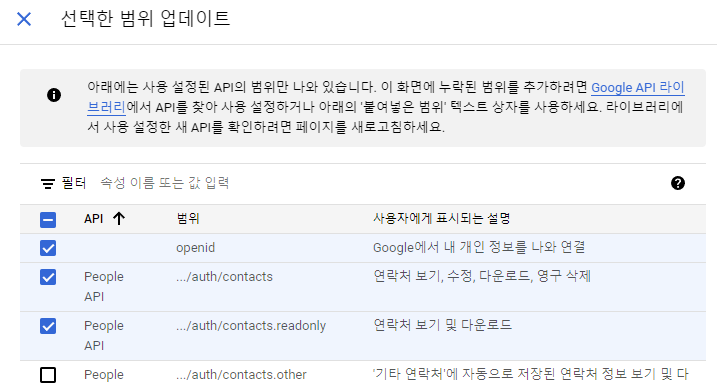
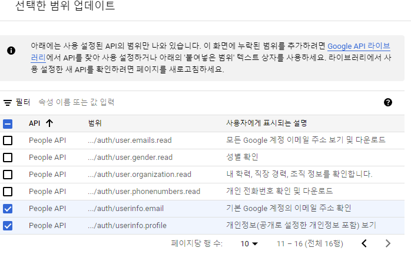

## 구글 소셜 로그인(sns 로그인/연동)

### Google Login API 설정 및 사용

- [주소](https://console.cloud.google.com/) 접속
- 상단 겁색 창에 google people 검색
- google people API 선택
- 프로젝트 선택 박스 클릭
- 새 프로젝트 등록 혹은 기존 프로젝트 선택
- google people API 화면에서 사용 선택
- OAuth 동의 화면 선택
- 외부 선택
- 별표쳐진 필수 입력사항 입력 후 다음
- 범위 추가 또는 삭제 클릭




- 업데이트 클릭->저장 후 계속 클릭
- 왼쪽 메뉴 - 사용자 인증 정보 클릭
- 사용자 인증 정보 만들기 ->OAth 클라이언트 ID 클릭
- 어플리케이션 유형: 웹 애플리케이션
- 승인된 자바스크립트 원본: URI 추가 -> http://localhost
- 승인된 리디렉션 URI : URI 추가 -> http://localhost/main/index
  - 승인된 후 구글에서 우리 서버로 호출하는 uri
- 저장
- 클라이언트 ID 복사

### Google Login API를 사용하여 할 작업

- 로그인 폼 제시
- 로그인 수행
- 로그인한 이용자의 이메일 주소 추출


### 테스트 파일

#### application.properties

```html
server.port=80
#spring.mvc.view.prefix=/WEB-INF/jsp/
#spring.mvc.view.suffix=.jsp

# Thymeleaf
spring.thymeleaf.cache=false
spring.thymeleaf.prefix=classpath:/templates/thymeleaf/
spring.thymeleaf.suffix=.html
spring.thymeleaf.view-names=*
```

#### IndexController.java

```java
package com.ezenac.glogin;

import java.util.*;

import org.json.simple.JSONObject;
import org.json.simple.parser.JSONParser;
import org.springframework.stereotype.Controller;
import org.springframework.web.bind.annotation.GetMapping;
import org.springframework.web.bind.annotation.PostMapping;
import org.springframework.web.bind.annotation.RequestBody;
import org.springframework.web.bind.annotation.RequestMapping;
import org.springframework.web.bind.annotation.ResponseBody;

import lombok.extern.slf4j.Slf4j;

@Slf4j
@Controller
@RequestMapping("/")
public class IndexController 
{
   @GetMapping("login")
   public String login()
   {
      log.info("/login");
      return "login";
   }
   
   @PostMapping("main")
   @ResponseBody
   public String main(@RequestBody String sjwt)  //JWT(JSON Web Token)
   {
       String credential = sjwt.split("\\&")[0];
       String credential_value = credential.split("\\=")[1];  
       log.info(sjwt);
       log.info(credential_value);
       
       // [0]:Header, [1]:Payload, [2]:Signature
       String[] token = credential_value.split("\\."); 
       log.info(""+token.length);
       
       String b64payload = token[1];
       byte[] barr = Base64.getDecoder().decode(b64payload);
       String jsonString = null;
       
      try {
         jsonString = new String(barr, "UTF-8");
         log.info(jsonString);
         
         JSONParser jsParser = new JSONParser();
         JSONObject jsObj = (JSONObject)jsParser.parse(jsonString);
         
         String email = (String) jsObj.get("email");
         log.info("이용자 Email={}", email);
         
      } catch (Exception e) {
         e.printStackTrace();
      }
      
      return "main";
   }
}
```

- JWT(JSON Web Token) : 로그인 성공 후 구글에서 웹 토큰을 보내주는데 우리는 이 웹 토큰을 받아서 디코딩해서 사용해야 한다.
- sjwt.split("\\&")[0] : 웹토큰을 & 를 기준으로 분할해 왼쪽
- credential.split("\\=")[1] : 위에서 나눈 문자열을 = 을 기준으로 분할해 오른쪽
- credential_value.split("\\.") : 위에서 나눈 문자열을 . 을 기준으로 분할
  - [0]:Header
  - [1]:Payload : 주로 사용하는 정보는 여기에 들어있다.
  - [2]:Signature
- Base64.getDecoder().decode(b64payload) : 최종적으로 남은 문자열을 디코딩, 리턴값은 제이슨 문자열
- 제이슨 문자열을 parse 하여 email 등등 정보를 추출할 수 있다.

#### login.html

```html
<!DOCTYPE html>
<html>
<head>
<meta charset="UTF-8">

<title>구글 로그인 API 테스트</title>

<script src="https://accounts.google.com/gsi/client" async defer></script>

<script>
    function handleCredentialResponse(response) {
      console.log("Encoded JWT ID token: " + response.credential);
    }
    window.onload = function () {
      google.accounts.id.initialize({ //client_id에 자신의 OAuth2.0 클라이언트ID 입력
        client_id: "클라이언트 아이디",
        callback: handleCredentialResponse
      });
      google.accounts.id.renderButton(
        document.getElementById("buttonDiv"),
        { theme: "outline", size: "large" }  // customization attributes
      );
      google.accounts.id.prompt(); // also display the One Tap dialog
    }
</script>
</head>
<body>

<div id="g_id_onload" data-client_id="626174201649-6n4t0gn6q9345p57bd0g44ahvtatot3u.apps.googleusercontent.com"
  data-login_uri="http://localhost/main" data-auto_prompt="false">
</div>
<div class="g_id_signin" data-type="standard" data size="large"
  data-theme="outline" data-text="sign_in_with" data-shape="rectangular" data-logo_alignment="left">
</div>

</body>
</html>
```